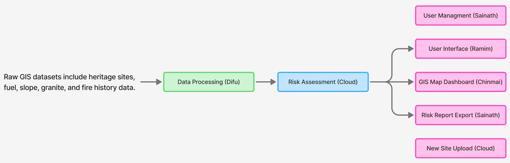

# Heritage Fire Watch

Heritage Fire Watch is a GIS web application for visualising heritage-related layers, supporting user access, and preparing for later fire risk analysis.

## System architecture and feature areas



### 1. User Management
- login and registration
- user session handling
- user profile access
- role-based access control (RBAC) support
- Profile page

### 2. User Interface
- overall application layout around the map
- navigation bar and sidebar structure
- profile entry point and future support pages
- user-friendly presentation for non-expert users
- accessible risk presentation, including colour-blind-friendly display choices

### 3. Interactive Map
- map display and basemap switching
- GIS layer loading and rendering
- layer toggles and popup interaction
- foundation for future drawing and selection tools
- display the risk level

### 4. Data Processing Pipeline
- preparation of raw datasets before use in the web app
- cleaning of fields, geometry, and coordinates
- generation of derived outputs for later analysis
- support for preprocessing workflows outside normal API requests

### 5. Fire Risk Assessment
- backend fire vulnerability calculation
- overview and detail outputs for the map
- support for cached or pre-generated results
- later risk visualisation on the frontend in coordination with accessible UI design

### 6. Data Export
- selection of map areas for reporting
- preparation of tabular outputs such as Excel files
- later export of selected records from the map

### 7. Site Upload
- entry of newly discovered heritage sites
- support for geometry and attribute submission
- foundation for later review and approval workflows

## Project structure

```text
app/
├── backend/               Flask backend application
│   ├── app.py             backend entry point
│   ├── data/              backend runtime data used by the app
│   ├── instance/          local SQLite database and uploaded files
│   ├── models/            database models
│   ├── routes/            backend API routes
│   ├── scripts/           backend scripts such as risk generation
│   ├── services/          backend business logic
│   ├── tests/             backend unit tests
│   └── utils/             backend helper functions
├── frontend/              React frontend application
│   ├── src/
│   │   ├── api/           frontend API calls
│   │   ├── components/    UI components
│   │   ├── config/        frontend config
│   │   ├── routes/        frontend routes
│   │   ├── types/         shared TypeScript types
│   │   └── utils/         frontend helper functions
│   ├── package.json
│   └── vite.config.ts
├── etl/                   data processing and transformation module
├── data/derived/          processed analysis-ready datasets from the data processing module
├── demo/                  early prototypes and demo material
├── README.md
├── install.md
└── run.md
```

## Adding a new feature

When a new feature is added, the usual pattern is:

1. Add or update frontend UI under `frontend/src/components/`.
2. Add or update frontend API calls under `frontend/src/api/`.
3. Add or update frontend routing under `frontend/src/routes/` if a new page or route is needed.
4. Add or update backend routes under `backend/routes/`.
5. Add or update backend logic under `backend/services/`.
6. Add a database model under `backend/models/` only if the feature needs persistent storage.
7. Add backend scripts under `backend/scripts/` if the feature depends on generated outputs or offline processing.
8. Add or update `etl/` only if the feature belongs to the shared data-processing workflow rather than the backend app itself.

Examples:
- A new backend-supported frontend feature would usually touch `frontend/src/components/`, `frontend/src/api/`, `backend/routes/`, and `backend/services/`.
- A new study-area processing workflow would more likely extend `etl/` and then produce or update analysis-ready datasets under `data/derived/`.

## API endpoints

### Core backend
- `GET /api/test`

### Authentication
- `POST /api/auth/register`
- `POST /api/auth/login`
- `GET /api/auth/me`
- `POST /api/auth/logout`

### Module status endpoints
- `GET /api/risk/status`
- `GET /api/permissions/status`
- `GET /api/export/status`
- `GET /api/site-upload/status`

### Layer endpoints
- `GET /api/layers`
- `GET /api/layers/uploaded-sites`
- `GET /api/layers/<layer_name>`
- `GET /api/layers/<layer_name>/overlay`
- `GET /api/layers/<layer_name>/image`

### Site upload endpoints
- `POST /api/site-upload/sites`
- `POST /api/site-upload/sites/<site_id>/photo`

## Health and layers

The backend test/health-style endpoint is:

- `GET /api/test`

It returns basic backend status information, including:
- a backend test message
- configured layer names
- whether authentication is enabled
- whether the database is configured

Map layers are served through:

- `GET /api/layers`
- `GET /api/layers/uploaded-sites`
- `GET /api/layers/<layer_name>`
- `GET /api/layers/<layer_name>/overlay`
- `GET /api/layers/<layer_name>/image`

Vector layers are returned as GeoJSON. Raster overlays such as fuel and slope use the `overlay` and `image` endpoints.

The layer API reads its backend-facing files from `backend/data/`. Processed source datasets such as `sites.gpkg`, `granite.gpkg`, `fire_history.gpkg`, `fuel.tif`, and `slope.tif` are copied there from `data/derived/analysis_ready/`, while `backend/data/risk_outputs/` stores outputs generated by the risk module.

## Tech stack

### Frontend
- React
- TypeScript
- Vite
- Leaflet
- React-Leaflet

### Backend
- Flask
- Flask-SQLAlchemy
- Flask-CORS

### Spatial and data tools
- GeoPandas
- Rasterio
- Shapely
- QGIS for manual validation and comparison when needed

### Database
- SQLite for the current development and demo stage
- PostgreSQL as a possible later option for larger-scale deployment
