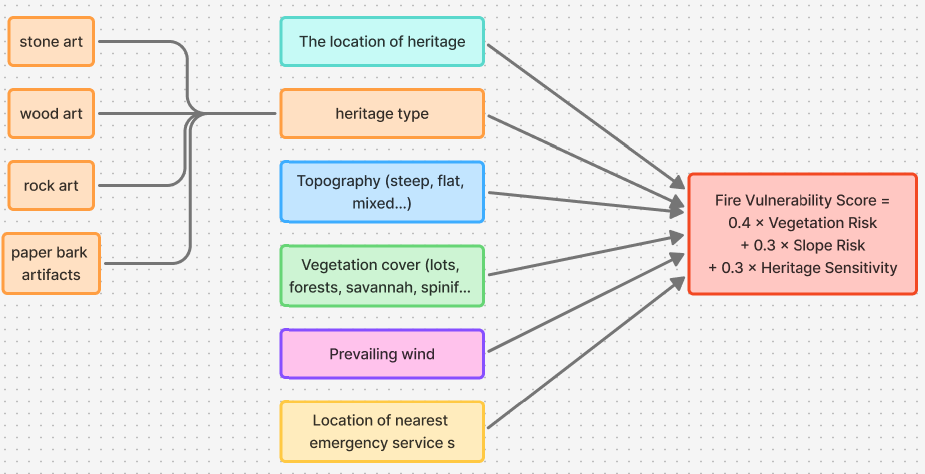
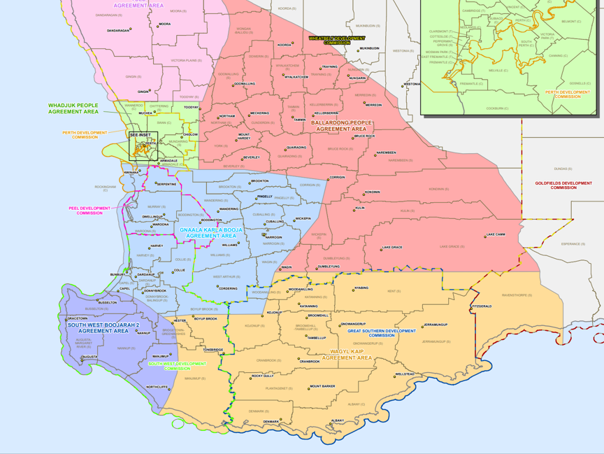

# Meeting_3

| Meeting No: | 3 |
| --- | --- |
| Meeting Type: | Team |
| Date: | 12/03/26 |
| Time: | 10:00am - 11:00am |
| Place of Meeting: | Reid Library Group Study Room 3 |
| Facilitator: | Karla Ivkovic |
| Recorder: | Cloud Wang |

**Attendees:**

| Name | Student No. |
| --- | --- |
| Cloud Wang | 24408996 |
| Sainath Reddy Mogullanolla | 24473572 |

### **Agenda**
- Review the project objectives and scope
- Discuss potential data sources for heritage site information
- Discuss factors for calculating the Fire Vulnerability Score
- Discuss the concept and design of the GIS application
- Discuss the initial development region
- Discuss the technical workflow for data processing and visualization

### **Discussion**
- Discussed the overall **project goal**. The aim of the project is to develop a GIS-based tool that helps identify and visualize cultural heritage sites that may be vulnerable to bushfires.

- Identified several **potential data sources** for heritage site information, including **ACHIS**, **InHerit**, and **Data WA**.

- Discussed the factors that should be considered when calculating the **Fire Vulnerability Score**. As illustrated in **Figure 1**, the score may be influenced by several variables, including:

  - Heritage type (e.g., stone art, wood art, rock art, paper bark artifacts)
  - The geographic location of heritage sites
  - Topography (e.g., steep, flat, or mixed terrain)
  - Vegetation cover (e.g., forests, savannah, spinifex, etc.)
  - Prevailing wind conditions
  - Distance to the nearest emergency services

  These factors can be combined to estimate the vulnerability of heritage sites to bushfires.

- Discussed the **concept of the application**. The application will function as a map-based system similar to a security zone visualization tool. It will display different areas on a map along with their associated **risk levels**. Areas with higher risk levels indicate a higher probability that heritage sites in that region may be affected by bushfires.

- Discussed which region should be selected as the initial development area for the application. Based on the map shown in **Figure 2**, the **Wagyl Kaip Agreement Area** was selected as the initial development region, where permission from the Wagyl Kaip Aboriginal group has been obtained. This region will serve as the initial testing and development area.

- Discussed the technical workflow for processing and visualizing the data. Heritage site data will first be extracted from the **ACHIS database** and exported into **CSV format**. The data will then be converted into **GeoJSON format** using tools such as **geojson.io**.

- After the data conversion, the geographic data will be integrated into the application using **Leaflet** and **OpenStreetMap**, two JavaScript libraries commonly used for interactive web maps. A simple prototype map has already been successfully implemented as a demonstration.

- Based on the discussion, the following potential development steps were identified:

  1. **Data preprocessing**  
     Prepare and clean the geographic data, export it into common formats such as CSV, and convert it into GeoJSON.

  2. **Data integration**  
     Import the processed data into the application and ensure it can be correctly displayed on the map.

  3. **Module development**  
     Develop additional modules, including the Fire Vulnerability calculation module, visualization components, and the user interface.

### **Figures**
**Figure 1.** Fire Vulnerability Score factors.

**Figure 2.** Map of Aboriginal Agreement Areas in Western Australia highlighting the Wagyl Kaip Agreement Area.

### **Agreed Task**
- Since the attendance was low, we plan to schedule a catch-up meeting on Saturday at 10:00 AM to ensure everyone is on the same page.