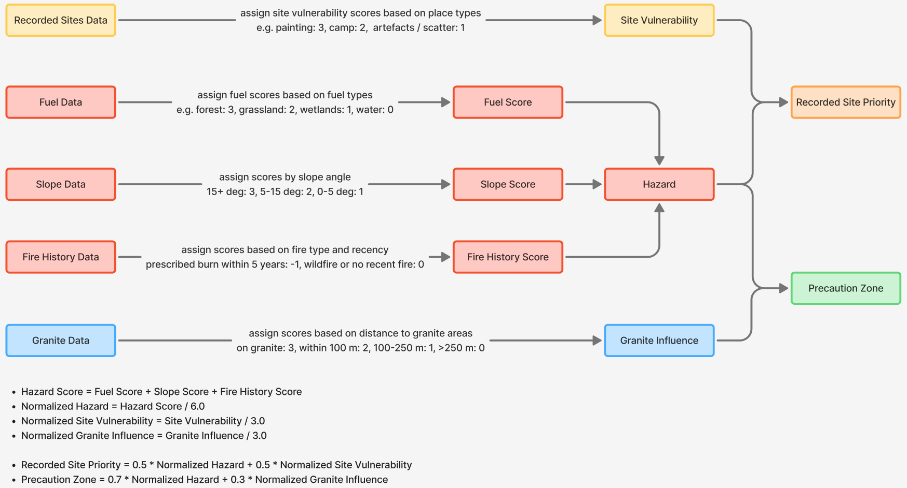

# Karla Heritage Watch Risk Assessment Module Documentation

## Overview

The module transforms GIS data, including heritage sites, granite, slope, fuel, and fire history, into fire risk outputs that are used in the web map. These outputs help land managers and project users make decisions to protect cultural heritage.

The module addresses two main questions:

- What is the fire risk for recorded cultural heritage sites?
- Which areas require precaution, and what are their risk levels?

To answer these, the module produces two outputs:

- `Recorded Site Priority` for known cultural heritage sites, where priority reflects their fire risk level
- `Precaution Zone` for areas that may contain heritage, indicating where precaution is needed based on fire risk

This separation is intentional because known sites and potential heritage areas represent different kinds of evidence.

## Inputs and Outputs

The risk assessment module reads source data from `app/backend/data/`, copied from the data processing module's `app/data/derived/analysis_ready/`.

Main inputs are `sites.gpkg`, `granite.gpkg`, `fire_history.gpkg`, `fuel.tif`, and `slope.tif`. The analysis CRS is `EPSG:7850`.

Main outputs are `recorded_site_priority.geojson`, `recorded_site_priority.gpkg`, `precaution_zone.geojson`, and `precaution_zone.gpkg`. The GeoJSON files are used for frontend map display in `EPSG:4326`.

## Core Model Logic

The diagram below shows the high-level risk assessment workflow.

### 1. Hazard

Hazard represents the background environmental fire danger. It is derived from fuel type, slope, and fire history, which are converted into scores and combined into a single hazard score and level.

The module also generates `hazard_overview.gpkg` as an intermediate output for later processing.

---

### 2. Site Vulnerability

Site vulnerability reflects how sensitive a recorded heritage site may be to fire. It is primarily determined by `place_type`, using a predefined mapping to vulnerability scores.

If a site belongs to multiple place types, the highest score is used. Fallback logic is applied when `place_type` is missing, using keywords in `place_name`.

The module generates `site_vulnerability.gpkg` as an intermediate output.

---

### 3. Granite Influence

Granite influence is used as an indicator of potential heritage significance, as granite is often associated with water sources, resources, and Aboriginal activity. Areas closer to granite are assigned higher scores based on distance thresholds.

This allows the module to highlight areas that may require precaution, even where no heritage sites are currently recorded.

The module generates `granite_influence.gpkg` as an intermediate output.

---

### 4. Recorded Site Priority

Recorded Site Priority is calculated for known heritage sites by combining local hazard and site vulnerability.

Hazard values are linked to each site using spatial joins. Recorded site hazard currently uses the configured aggregation method, which is currently set to `max` (highest overlapping hazard value). The final priority score is derived from normalized hazard and vulnerability scores.

---

### 5. Precaution Zone

Precaution Zone is calculated for areas that may contain unrecorded heritage by combining local hazard and granite influence.

Granite influence values are linked to hazard cells based on overlap with granite proximity zones. Hazard cells that overlap recorded sites are then removed from the output. The final precaution score is derived from normalized hazard and granite influence scores.

## Configuration

Key risk module settings are now centralized in `app/backend/services/risk/config.py`.

This includes:

- score bands and level thresholds
- fuel and place type mappings
- granite and fire history settings
- excluded site IDs
- recorded site hazard aggregation setting

## API and Frontend Integration

The risk assessment module mainly supports the frontend through generated layer files such as `recorded_site_priority`, `precaution_zone`, and supporting context layers, rather than through a dedicated risk calculation API.

The generated layers are exposed through `app/backend/routes/layer_routes.py` and `app/backend/services/layer_service.py`. The main exposed layers are `recorded_site_priority` and `precaution_zone`. In addition, supporting layers such as `granite`, `fire_history`, `fuel`, and `slope` are also exposed through the backend layer API to provide supporting map context.

## Performance Improvements

The risk generation workflow was improved to handle larger datasets more efficiently.

In `generate_hazard_outputs.py`, fire history previously had to be checked against polygons for every hazard cell during the main hazard loop. This was improved by converting fire history polygons into two raster grids, one for fire year and one for fire type. The hazard loop can now read fire history values directly from those grids instead of repeating polygon checks for each cell.

In `generate_precaution_zone.py`, overlap checks also became more targeted. Instead of comparing every granite zone or recorded site against the entire hazard layer, the script now first finds nearby hazard cells using a spatial index and bounding box search, then runs the actual intersection check only on that smaller set.

Recorded site overlap removal in `generate_precaution_zone.py` was also improved. Instead of using one large combined site geometry with `union_all()`, the script now processes recorded sites one at a time using the hazard spatial index, which keeps the geometry checks smaller and more focused.

## Testing and Validation

The repository includes unit tests in `app/backend/tests/test_risk_module.py`.

Current test coverage includes:

- place type alias mapping
- multiple place type handling
- council keyword fallback logic
- hazard score calculation
- hazard level bands
- granite distance bands
- normalization functions
- site priority and precaution score calculation

The risk generation scripts now validate required input files before processing and fail early if key dependencies are missing.

In addition to automated tests, manual GIS inspection was also important for this module because output correctness depends on spatial data alignment and interpretation, not only on pure function results.

## Current Limitations

- recorded-site hazard aggregation is currently configured as `max` rather than area-weighted overlap
- threshold values and weightings are still project-stage settings
- hazard normalization uses a fixed score range (currently 6.0 as the maximum possible value)
- more end-to-end tests could still be added for the full GIS output workflow

## Appendix A: Processing Workflow

The main processing scripts are in `app/backend/scripts/risk/`.

Current generation order:

1. `generate_hazard_outputs.py`
2. `generate_site_vulnerability.py`
3. `generate_granite_influence.py`
4. `generate_recorded_site_priority.py`
5. `generate_precaution_zone.py`

Helper runners:

- `run_all.ps1`
- `run_all.sh`

Generated outputs are written to `app/backend/data/risk_outputs/`. Important files include `hazard_overview.gpkg`, `site_vulnerability.gpkg`, `granite_influence.gpkg`, `recorded_site_priority.gpkg`, `recorded_site_priority.geojson`, `precaution_zone.gpkg`, `precaution_zone.geojson`, and `manifest.json`, which stores output metadata and a small config snapshot for generated layers.

## Appendix B: Key Files

- `app/backend/scripts/risk/generate_hazard_outputs.py`  
  Generates hazard outputs from source fuel, slope, and fire history data.

- `app/backend/scripts/risk/generate_site_vulnerability.py`  
  Generates vulnerability outputs for recorded heritage sites.

- `app/backend/scripts/risk/generate_granite_influence.py`  
  Builds granite influence zones used by the precaution workflow.

- `app/backend/scripts/risk/generate_recorded_site_priority.py`  
  Produces the final recorded site priority layer by combining hazard and site vulnerability.

- `app/backend/scripts/risk/generate_precaution_zone.py`  
  Produces the final precaution zone layer by combining hazard and granite influence.

- `app/backend/services/risk/risk_model.py`  
  Defines the main hazard, vulnerability, site priority, and precaution score calculation functions.

- `app/backend/services/risk/scoring.py`  
  Implements lookup based scoring, normalization, and level conversion logic.

- `app/backend/services/risk/config.py`  
  Stores the enums, score mappings, score bands, and configuration constants used by the risk model.

- `app/backend/services/risk/lookups.py`  
  Provides a lightweight import bridge between `config.py` and the scoring logic.

- `app/backend/services/risk/metadata.py`  
  Stores manifest writing and input file validation helpers used by the risk generation scripts.

- `app/backend/services/layer_service.py`  
  Serves generated GeoJSON outputs to the frontend map layer API.

- `app/backend/tests/test_risk_module.py`  
  Contains unit tests for hazard, vulnerability, granite, normalization, and integrated scoring logic.
